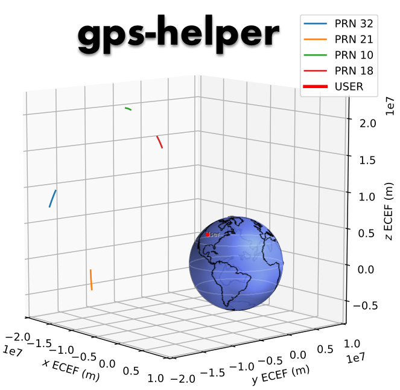

[](https://pypi.python.org/pypi/gps_helper)
[](http://gps-helper.readthedocs.io/en/latest/?badge=latest)
[](https://travis-ci.com/gps-helper/gps-helper)
[](https://coveralls.io/github/gps-helper/gps-helper?branch=master)

Tools and examples for GPS

## Documentation

Documentation is hosted on [readthedocs](https://gps-helper.readthedocs.io). Interactive 
[Jupyter notebooks](https://gps-helper.readthedocs.io/en/latest/nb_examples.html) are viewable and also included this 
repository.

## Installation

This package is available for download through [pypi](https://pypi.org/project/gps-helper/).

```commandline
$ pip install gps-helper
```

To use the plotting functionality, there are extra requirements.

```commandline
$ pip install gps-helper[plotting]
```

For [matplotlib](https://matplotlib.org/users/installing.html) and [mayavi](https://docs.enthought.com/mayavi/mayavi/installation.html), 
you will need to have backends installed to view the figures.